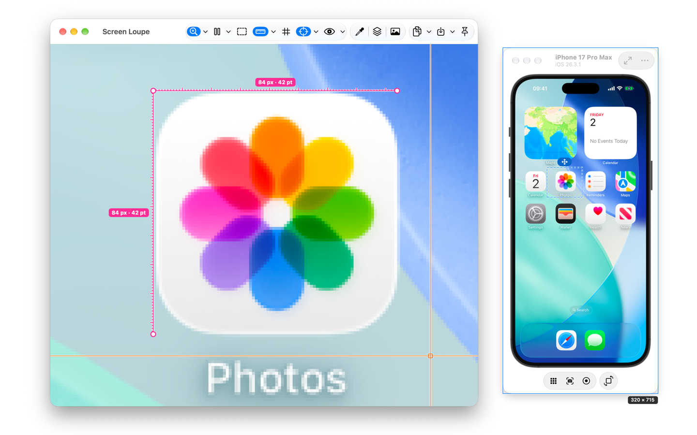
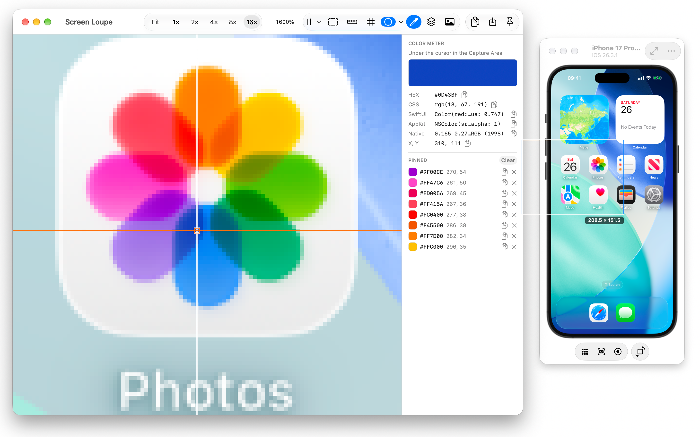
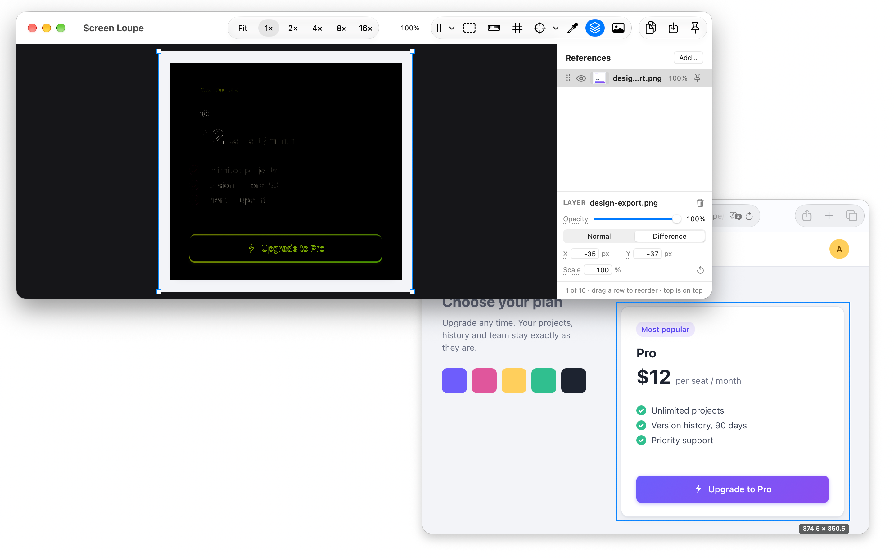

# Screen Loupe Guide

Screen Loupe shows one spot of your screen magnified in a window of its own, while you keep working in that spot. The workflow is **place → zoom → pan → inspect → copy**.

[Home](.) · [Download](https://github.com/ayenora/screen-loupe/releases/latest) · [Support](support)

## Getting started

1. Open the DMG and drag Screen Loupe to Applications. It needs macOS 15.2 Sequoia or later.
2. Open it. The first time, the Viewer asks for **Screen Recording** access: click Continue, turn Screen Loupe on in System Settings › Privacy & Security › **Screen & System Audio Recording**, and reopen the app when macOS asks. The app captures no audio.
3. A blue frame — the **Capture Area** — appears on screen, and the **Viewer** window beside it shows what is inside the frame, live.

Closing the Viewer hides the frame too; the app stays in the menu bar (the magnifier icon). Show Viewer there, or click the Dock icon, brings both back.

## The Capture Area

- **Move** it by its line or the grip tab above it; **resize** it by the handles that appear when the pointer comes near. Hold **Shift** on a corner to keep it square.
- **Clicks inside go to the app underneath**, so you keep working there.
- **Arrow keys** move it by one pixel (Shift: ten); with Option they resize it. Click the frame first.
- **Snap with ⌘:** hold ⌘ while moving or resizing, and an edge near a window's or a display's edge snaps onto it.
- **Fit to a window:** the window button behind » beside the tab, Window › Fit Capture Area to Window…, or ⌃⌥⌘W. Point at a window — it is tinted — and click: the frame takes exactly that window. The click doesn't reach the app, so nothing is tapped. Escape cancels.
- **Reset:** Window › Reset Capture Area, or the menu bar item, brings a frame stretched over a large window back to its first-launch size, centred on its display, and turns the magnet and the pin off so it moves again.
- **Pin** (the pin beside the tab) locks the frame against stray drags; a click turns it on or off, and its ▾ chooses how:
  - **Pinned:** the frame neither moves nor resizes.
  - **Fixed Position:** it can't be moved, but its handles still resize it — handy while a reference is aligned.
  - **Magnet to Window…:** click a window, and the frame follows it as it moves, keeping its place on it — the Simulator, a browser window. A frame fitted to the window (Fit to Window first) also follows the window's size: the window's own edges, under the frame's line, resize the window and the frame with it; drag the frame off by its tab and back onto the window to fit it again. When the window closes, hides, minimises or goes to another Space, the magnet lets go and says so; the frame stays where it was.
- **Margins** (the button with a dashed square beside the pin's ▾, shown while a magnet's frame is fitted to its window, or Window › Capture Area Margins): capture only an inner part of the window — a web page without the browser's toolbar — and keep it as you resize the window. Set L, T, R and B in the Margins panel below the position box: click it to expand it, then type a value, or drag a field's letter left or right. The band between the window's edge and the captured part is tinted, and clicks go through it; pick its colour and opacity in the same panel. The margins turn off when the frame stops being fitted.
- **»** beside the pin opens the buttons used less often: the viewport handle, bring the Viewer forward (when another window covers it) and Fit to Window. Rest the pointer on any button to see its name.
- **The part the Viewer shows:** zoomed in, a dashed outline inside the frame marks what the Viewer shows, while you pan or zoom and while the pointer is near the frame.
- **Viewport handle** (the dashed-rectangle button, View › Show Viewport Handle, or ⌃⌥⌘M): the outline stays, with a small handle beside it; drag the handle to pan the Viewer from the frame. Everything else inside the frame still goes to the app underneath.
- The tab shows the size in points and pixels, one size in points on a 1× display, where they are the same; on hover a box beside the frame shows its edges from the display's top-left corner.

## The Viewer

- **Zoom:** the presets Fit, 1×, 2×, 4×, 8×, 16×, 32× and 64× (100% to 6400%) in the zoom panel, the loupe's ▾ or View › Zoom, pinch, ⌘ + scroll wheel, `+` / `-`, or type a percentage in the zoom panel's field and press Return (Escape leaves it). Pinch, the wheel, and `+` / `-` with the pointer over the Viewer keep the point under the pointer in place; a preset or a typed zoom brings the middle of what you see to the middle of the Viewer. Presets, `+` / `-` and Reset Zoom glide there in a fifth of a second, or change at once with Reduce Motion on.
- **Zoom panel:** the presets, the one matching the zoom highlighted, and the zoom in percent. The loupe, the first button in the toolbar, shows and hides it; its ▾ also chooses where it goes: **In the Toolbar**, a strip under the toolbar, or **Floating Panel**, a small window beside the Viewer that moves with it. Drag the floating panel anywhere — left, right or below the Viewer — and it keeps that place next to the Viewer, also after a relaunch; its close button hides it. In full screen it shows as the strip.
- **Pan:** drag, or scroll with two fingers.
- **Nothing moves on its own.** Moving or resizing the frame keeps the Viewer's zoom and framing; Fit applies only when you ask for it.
- **Size Window to Area** (View menu, ⌥⌘0) sizes the window to show the whole magnified area.
- **Keep on Top** (the pin at the right of the toolbar) keeps the Viewer above other apps.
- **Side panels:** the Color Meter, References and Recent Captures are the three segments of one toolbar control; each turns its panel on and off. A window too narrow for the whole toolbar puts the rest in its » menu.
- The pointer inside the frame shows in the Viewer as a crosshair, an arrow, or the original cursor captured with the pixels; the ▾ beside its button chooses.

## Copying and saving

| Command | What you get |
|---|---|
| **Copy View** ⌘C | Exactly what the Viewer shows, at its zoom — with a colour vision simulation while one is on. |
| **Copy Source** ⇧⌘C | The area as it is on screen, unmagnified, at native resolution. |
| **Save View…** ⌘S / **Save Source…** ⇧⌘S | The same as a PNG file. |

The toolbar's Copy button copies the view and its ▾ offers Copy Source too; Save saves the view and its ▾ offers Save Source.

To copy just a part of the view:

- **⌥-drag** a rectangle in the Viewer: that region is copied on letting go.
- **Select** (⌘E, or the dashed-rectangle button): drag a selection snapped to whole screen pixels, adjust it by its handles, then ⌘C copies just the selection. The label under it gives its size in pixels and points and its place, `32 × 22 px · 16 × 11 pt · x 11, y 11` (pixels only on a 1× display and on an image file). ⌘A selects the whole Capture Area, at the current zoom, even where it reaches beyond the window. Space-drag pans while Select is on; Escape clears.

## Freezing a moment

- **Space** in the Viewer freezes the current frame — a hover, a pressed button, an animation frame. Space again resumes.
- **F13** freezes from any app, so you can hold the mouse down somewhere else, press F13, let go, and copy the frozen state.
- **Freeze later:** the ▾ beside the pause button freezes in 3, 5 or 10 seconds, no keyboard needed.
- **Use Frozen Frame as Reference** (the same ▾, or the View menu): the frozen frame becomes a reference layer in Difference over the Capture Area. Resume, and whatever changed since glows while everything else stays black.

## Tools

- **Color Meter** (the eyedropper segment in the toolbar): the pixel under the pointer as HEX, CSS `rgb()`, SwiftUI, AppKit and the display's native value, with its position. Click a colour below — recent, favourite, Text or Background — to see it in every format instead; the line above the swatch names it, and a recent row is highlighted. Move the pointer over the image — in the Viewer or inside the Capture Area — and the pixel under it is back.
  - **Recent:** every click on a pixel keeps its colour — the last eight, kept between launches — except a click that fills a favourite. Right-click a row to copy it as HEX, CSS, SwiftUI or AppKit, add it to Favorites, or remove it.
  - **Favorites:** eight slots for the colours you want to keep. Right-click one to copy or remove it.
  - **Contrast:** Text and Background with an "Aa" preview, the WCAG 2 contrast ratio and Pass or Fail for Text AA, Large AA, Text AAA and Large AAA (large = 18 pt, or 14 pt bold). Swap exchanges them.
  - The Color Meter always reads the real pixels, also while a colour vision is simulated.
  - **Choosing where a colour goes:** click Text, Background or a favourite slot to make it the target, marked with a ring: the next clicks on pixels, and recent colours you click, go there. Without a target, clicks on pixels only go to Recent. While Text or Background is the target, clicking a filled favourite puts it there too. Text and Background stay the target, so you can try many backgrounds against one text; a favourite takes one colour, which doesn't go to Recent. Click the target again, or press Escape, to stop. While you point at the image, the target shows that pixel, outlined dashed.
- **Ruler:** two rulers in screen pixels, one at a time. The ruler button turns the chosen one on and off; its ▾ chooses one and turns it on.
  - **Corner Ruler** (⌘R): drag the line or a length label to move it, an arm's end to stretch it; pin it to keep it on its pixels while you zoom and pan, also over a snapshot.
  - **Selection Ruler** (⌥⌘R): the width and height of the Select tool's selection, as lines with their lengths just outside it — above and left, or below and right at the Viewer's edge. It turns Select on; draw, move or resize the selection and the lengths follow.
- **Pixel grid:** lines on the pixel boundaries from 800% on.
- **Colour vision** (eye button, View › Color Vision, ⌘Y): see the screen as a person with another colour vision sees it, live, while you work on the design. The eye button turns the chosen simulation on and off; its ▾ chooses one and turns it on: Protanopia and Protanomaly (red), Deuteranopia and Deuteranomaly (green; weak green is the most common, about 5 in 100 men), Tritanopia (blue) or Grayscale, to check contrast without colour. It covers everything the Viewer shows — the live view, a frozen frame, a snapshot, an image, the references over them. An orange border and "Deuteranopia · simulated" show while it is on. Copy View and Save View include it, so a bug report can show it; Copy Source, Save Source and the Color Meter keep the real colours. It starts off at every launch, with the last mode chosen. The simulation is the model of Machado, Oliveira and Fernandes (2009), in linear light, from your display's colour profile.
- **References:** lay design exports over the live pixels — Add… in the panel, or drop the files on the Viewer — set opacity, or switch to Difference — matching pixels turn black. To try it, open the [example page](examples/reference-check/) and add its [design export](examples/reference-check/design-export.png) as a reference.
- **Before and after:** right-click a Recent Captures row and choose Use as Reference, or use the frozen frame (above). The picture becomes a layer on top in Difference at full opacity, so you can capture, change your CSS or SwiftUI view, and see exactly what moved. A snapshot lands on the pixels it was taken from; an image file or a pasted image lands at the top-left. If the Capture Area has moved since, drag the layer into place. A capture shown in the Viewer stays, so you can compare two captures with each other; layers keep their place on the screen's pixels over a snapshot too.
- **Recent Captures:** your last eight snapshots and opened or pasted images, kept to zoom, measure and pick colours on later. The camera beside the Live row, or View › Take Snapshot (⌘T), takes a snapshot of what the live view shows — the part of the Capture Area in the Viewer, or just the selection while there is one; the frozen frame while frozen — whatever the Viewer shows, and adds it without switching to it. Paste and Add… in the panel's header add the clipboard's image or an image file, as Edit › Paste for Inspection and File › Open Image… do; the footer counts the rows out of eight. A snapshot opens at the zoom it was taken at, its pixels where they were. The Live row shows the Capture Area's size in pixels. Copies and saves don't add rows. The Live row goes back to the live view. Captures stay on your Mac through quitting, a crash or a restart, until you delete one (×) or a ninth pushes out the oldest; the Viewer reopens on what it showed — the capture at its zoom and position, or the live view.
- **Link View** (the link button left of a row's ×): linked captures share one zoom and position, so you can take the same area in the light and the dark theme and flip between them at the same spot; each keeps its own selection. Only pictures of the same size can be linked, since only then does the same zoom show the same pixels: while any is linked, the button of a capture of another size is dimmed, and its tooltip gives both sizes. A capture you link takes the linked ones' zoom and position; wherever you leave one of them, the others open there too.
- **Open Image** (File › Open Image…, ⌘O, or the menu bar item): look at an image file — a screenshot, a design export, a photo — with the same tools: zoom, ruler, Color Meter (with opacity for transparent pixels), references, Copy and Save. Its colours stay in its own colour profile. It becomes a row in Recent Captures and stays in the Viewer, also with References open, until Escape goes back to live.
- **Dropping images:** drag image files from Finder onto the Viewer. With References open they become reference layers; with Recent Captures open they open for inspection; otherwise a menu asks which.
- **Pasting an image:** ⌘V in the Viewer takes an image from the clipboard — a design tool's Copy as PNG, a screenshot, image files copied in Finder — the same way as a drop. Edit › Paste as Reference and Paste for Inspection skip the question.

## Screenshot studio

A screenshot tool of its own, for exact, clean pictures — App Store and website screenshots, docs, bug reports. Screenshot › Show Screenshot Studio, or the menu bar item, shows an orange frame and a floating palette; the palette's close button hides them. They are apart from the Capture Area and the Viewer, so the Viewer can be in the picture, and every palette button is also in the Screenshot menu. Size, Timer, Output, Background and One Window's ▾ open their menus beside the palette, leaving the app you work in active; Background shows its colours and gradients as rows of swatches.

- **The frame** moves and resizes like the Capture Area: handles, Shift for a square, ⌘ to snap, arrow keys, and Fit to Window.
- **Capture, Copy, Save:** Copy puts the picture on the clipboard, Save asks where to save it, Capture does both. The picture is exactly the pixels inside the frame, at the display's resolution, as a macOS screenshot shows them, windows' shadows included, without the pointer; the studio's own frame and palette are never in it, though they stay on screen. A frame across two displays isn't captured.
- **Size:** the Mac App Store sizes (1280 × 800 to 2880 × 1800 px), web sizes, a size you type, or up to four of your own (Custom Size…). Sizes are in pixels of the frame's display. Size, Fit to Window and Aspect Lock are off while One Window is on.
- **Aspect Lock** keeps the frame's proportions while you resize it.
- **Timer:** 3, 5 or 10 seconds, to catch an open menu or a hover. Pressing Capture, Copy or Save again stops the countdown.
- **Background:** the real screen, a colour, a gradient or an image of your own. It covers the display under every window, so you see on screen what the picture will show. Hide the Dock yourself (⌥⌘D) if it shouldn't be in the picture. It stays on screen during One Window but isn't in its picture.
- **One Window:** click a window to capture it alone, whole even where it is covered: the picture is the window and, with One Window Shadow on, its shadow — nothing else, on transparency, at the display's resolution. The background you chose stays on screen but isn't in the picture. While One Window is on, the orange frame is hidden and a green outline marks the window; notices and the timer's countdown show beside the window's name, or beside the palette while you pick the first window. Until a window is picked, Capture, Copy and Save only beep and say "Pick a window first". The ▾ right of the palette's One Window button opens a menu with One Window Shadow (also in the Screenshot menu, and settable before picking), Pick Another Window (Escape keeps the window you had) and End One Window. If the window closes, hides or can't be captured, One Window ends and the frame comes back where it was; a capture or countdown waiting for it is cancelled, with a notice saying why. Hiding the studio cancels a countdown or capture without a word.
- **Output** (the palette's Output button, or Screenshot › Output): PNG, JPEG or HEIC; sRGB or the display's colours; native pixels or 1× for the web. A PNG or HEIC has an alpha channel only when the picture has transparent pixels — a One Window picture — so a store that refuses alpha takes every frame picture as it is; JPEG lays transparent pixels on white. No date, device or location is written into the file.

## Keyboard shortcuts

In the Viewer:

| Shortcut | Action |
|---|---|
| ⌘O | Open Image… |
| ⌘V | Paste an image |
| ⌘C / ⇧⌘C | Copy View / Copy Source |
| ⌘S / ⇧⌘S | Save View… / Save Source… |
| Space | Freeze / resume |
| ⌘T | Take Snapshot |
| ⌘E | Select tool |
| ⌘A | Select the whole Capture Area |
| ⌘R | Corner Ruler |
| ⌥⌘R | Selection Ruler |
| ⌘Y | Colour vision simulation on / off |
| ⌘0 | Reset zoom |
| ⌥⌘0 | Size Window to Area |
| `+` / `-` | Zoom in / out |
| ⌥-drag | Copy a region |
| Escape | Clear a selection; else cancel a countdown and go back to live; else drop the Color Meter's target; else back to live |

On the Capture Area and the studio's frame (click it first): arrows move by 1 px, ⇧ by 10 px, ⌥ resizes; hold ⌘ while dragging to snap, ⇧ on a corner for a square.

Global, from any app — each can be changed or cleared in Settings › Shortcuts:

| Shortcut | Action |
|---|---|
| ⌃⌥⌘L | Show / Hide Capture Area |
| ⌃⌥⌘V | Show / Hide Viewer |
| ⌃⌥⌘C | Copy View |
| ⌃⌥⇧⌘C | Copy Source |
| F13 | Freeze / Resume Viewer |
| ⌃⌥⌘W | Fit Capture Area to Window |
| ⌃⌥⌘M | Show / Hide Viewport Handle |

## Settings

Settings… (⌘,) has five tabs: General (launch at login, Dock or menu bar only), Capture Area (frame colour, line and labels), Viewer (background, grid, crosshair colour, wheel zoom), Screenshots (folder, file names) and Shortcuts.

## Updates

Help › Check for Updates…, also in the menu bar item, opens the latest release on GitHub in your browser; the app itself never goes online. Homebrew users get new versions with `brew upgrade`. The downloaded copy has the item; a copy from the Mac App Store, updated by the store, and a copy built from source don't.

## If something doesn't work

- **The Viewer asks for access although you granted it:** quit and reopen the app; macOS applies Screen Recording access on launch.
- **Screen Loupe is missing from the list, or it is on and the Viewer still asks:** select it in the list and remove it with −, add it again with + from Applications, turn it on and reopen the app. This happens most often after an update.
- **A global shortcut is marked in Settings:** macOS or another app already uses it; choose another.
- Something else: see [Support](support).
